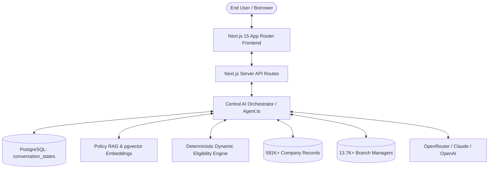

# CreditWise AI — Financial Intelligence & Loan Eligibility Platform

[](https://nextjs.org/)
[](https://react.dev/)
[](https://www.typescriptlang.org/)
[](https://www.postgresql.org/)
[](https://github.com/pgvector/pgvector)

**CreditWise AI** is an enterprise-grade AI financial assistant platform designed to automate loan eligibility evaluation, underwriting policy analysis, corporate employer tier lookup, and branch manager escalation across 25+ partner lending institutions.

---

## 🌟 Key Features

### 1. 🧠 Multi-Turn Conversational AI Agent
- **Unified Conversation State Machine**: Remembers user profile details (salary, loan amount, CIBIL, age, tenure, existing EMIs) across multi-turn sessions using PostgreSQL JSONB persistence (`assistant_conversation_states`).
- **Dynamic Slot Machine Flow**: Identifies missing underwriting slots and prompts conversationally without robotic repetitive forms.
- **Dynamic IST Time & Context Awareness**: Responds intelligently to greetings and context based on Indian Standard Time.

### 2. ⚡ Deterministic Multi-Bank Eligibility Engine
- Evaluates borrower profiles against official lending policies across top public/private banks and NBFCs (HDFC, ICICI, SBI, Axis, Kotak, IndusInd, Bajaj Finserv, Tata Capital, Poonawalla, Finnable, Fibe, ABFL, etc.).
- Calculates **Fixed Obligation to Income Ratio (FOIR)**, maximum eligible loan amounts, tenure options, interest rates (ROI), and estimated EMIs.
- Returns structured comparison tables:
  ```text
  | Bank | Status | CIBIL | Tenure | Est. EMI |
  ```

### 3. 🔍 Semantic Policy RAG (pgvector)
- **High-Dimensional Cosine Search**: Uses 1536-dimensional OpenAI vector embeddings indexed with PostgreSQL HNSW (`vector_cosine_ops`).
- Comprehensive extraction of rejection conditions, required KYC documents, salary cutoffs, and tier variations directly from master policy documents.

### 4. 🏢 591,000+ Corporate Company Tier Classification
- Fast lookup across 591,000+ indexed company records.
- Classifies employers into bank tiers (**Super CAT A, CAT A, CAT B, CAT C, Government**) to determine maximum loan multiplier rules and preferential interest rates.
- Live fallback integration via Incraax Search API for real-time company intelligence.

### 5. 📍 13,600+ Branch Manager Directory
- Search and connect pre-approved borrowers with official branch and sales managers across Indian cities, districts, and pin codes.

### 6. 📊 Real-Time Financial Calculators
- Interactive EMI calculation with month-by-month amortization schedules, interest breakdowns, and PDF export capabilities.

---

## 🏗️ Architecture & Tech Stack



- **Frontend**: Next.js 15 (App Router), React 19, Vanilla CSS Design System, Lucide React, HTML2Canvas & jsPDF.
- **Backend**: Next.js Route Handlers, Server Actions, PostgreSQL Connection Pooling (`pg`).
- **Database & Vectors**: PostgreSQL 15+ with `pgvector` and `uuid-ossp` extensions.
- **AI & Models**: OpenRouter API (`anthropic/claude-3.5-sonnet:beta`, OpenAI text-embedding-3-small).
- **Search & Integrations**: Incraax Search API for real-time web entity search.

---

## 📁 Project Directory Structure

```text
akshada-project/
├── app/                              # Next.js 15 App Router
│   ├── (auth)/                       # Authentication views (login, register, logout)
│   ├── admin/                        # Admin dashboard for user & document management
│   ├── api/                          # Backend REST API route handlers
│   │   ├── auth/                     # Authentication & session verification
│   │   ├── bank-managers/            # Branch manager directory search & recommendation
│   │   ├── chat/                     # Central AI conversational endpoint
│   │   ├── company/search/           # Corporate employer classification search
│   │   ├── conversations/            # Conversation thread management & pinning
│   │   ├── emi/                      # Saved EMI calculations
│   │   ├── policies/                 # Policy management & extracted master documents
│   │   └── profile/                  # User profile, KYC data & avatar upload
│   ├── bank-managers/                # Branch manager directory page
│   ├── emi/                          # EMI calculator page
│   ├── home/                         # Unified dashboard & chat assistant workspace
│   ├── policies/                     # Bank loan policy library
│   ├── profile/                      # User KYC profile management
│   └── globals.css                   # Global design tokens and styling
├── components/                       # Shared UI components
│   ├── EmiCalculator.tsx             # Interactive loan calculator & amortization table
│   ├── PoliciesView.tsx              # Policy viewer & document inspection
│   └── Topbar.tsx                    # Navigation and session header
├── lib/                              # Core business logic & AI engine
│   ├── ai/
│   │   ├── agent.ts                  # Central AI Agent & multi-turn dialog manager
│   │   ├── dynamicEligibilityEngine.ts # Rule engine for credit policies & FOIR
│   │   ├── responsePlanner.ts        # Dynamic response orchestration
│   │   ├── intentClassifier.ts       # Loan intent & financial NLP classifier
│   │   └── incraaxService.ts         # Live company web intelligence
│   ├── bankSearch.ts                 # Manager directory search with fuzzy matching
│   ├── companySearch.ts              # High-performance company category lookup
│   ├── policyRag.ts                  # Vector similarity search over master policies
│   └── db.ts                         # PostgreSQL connection pool
├── policy-master-files/              # Authoritative master bank policy text files
├── public/                           # Static assets, branding, and PDF bundles
├── scripts/                          # Utility & ingestion scripts
│   ├── ingest-policy-embeddings.ts   # Vector embedding chunking and DB ingestion
│   └── test-conversational-policy-rag.ts # RAG integration test suite
├── schema.sql                        # Complete PostgreSQL DDL schema definition
├── .env.example                      # Environment variables template
├── .gitignore                        # Production Git ignore rules
└── package.json                      # Dependencies and build scripts
```

---

## 🚀 Getting Started

### Prerequisites

1. **Node.js**: v18.18.0 or newer (v20+ recommended)
2. **PostgreSQL**: v15 or newer with `pgvector` extension installed
3. **OpenRouter API Key** (or OpenAI API Key)

---

### Step 1: Clone & Install Dependencies

```bash
git clone <your-repository-url>
cd akshada-project

# Install npm packages
npm install
```

---

### Step 2: Configure Environment Variables

Copy the provided template and fill in your actual credentials:

```bash
cp .env.example .env.local
```

Edit `.env.local`:

```env
# PostgreSQL Database Connection
DB_USER=postgres
DB_PASSWORD=your_database_password
DB_HOST=127.0.0.1
DB_PORT=5432
DB_NAME=login_db

# LLM / AI Central Agent (OpenRouter API)
OPENROUTER_API_KEY=your_openrouter_api_key_here
OPENROUTER_MODEL=anthropic/claude-3.5-sonnet:beta

# Semantic Policy RAG Embeddings (pgvector)
EMBEDDING_MODEL=text-embedding-3-small
EMBEDDING_DIMENSIONS=1536

# Live Web Search (Incraax)
INCRAAX_SEARCH_API_KEY=your_incraax_api_key_here
INCRAAX_SEARCH_URL=https://api.incraax.com/search

# Security & App URL
JWT_SECRET=your_jwt_secret_key_minimum_32_characters
NEXT_PUBLIC_APP_URL=http://localhost:3001
NODE_ENV=development
```

---

### Step 3: Database Setup & Migration

Ensure PostgreSQL is running, then create the database and apply the schema:

```bash
# 1. Create database in PostgreSQL
createdb -U postgres login_db

# 2. Run the complete schema script (creates tables, vector extensions, and indexes)
psql -U postgres -d login_db -f schema.sql
```

*(Optional)* Ingest policy vector embeddings for semantic RAG search:
```bash
npm run ingest:policy-embeddings
```

---

### Step 4: Run the Development Server

```bash
npm run dev
```

Open [http://localhost:3001](http://localhost:3001) in your browser.

- **Default Test User**: `admin@gmail.com` / `1234` (or register a new user at `/register`).

---

## 📦 Production Build & Deployment

### Local Production Build

To verify and start the production server locally:

```bash
# Compile and build the production bundle
npm run build

# Start the Next.js production server
npm run start
```

---

### Deployment Options

#### Option A: Vercel (Recommended for Next.js)
1. Push this repository to GitHub/GitLab.
2. Import the project into [Vercel](https://vercel.com).
3. In the project settings, configure the **Environment Variables** matching `.env.example`.
4. Ensure your PostgreSQL database (e.g. Supabase, Neon, AWS RDS, or Railway) has the `vector` extension enabled and allows inbound connections from Vercel.
5. Deploy!

#### Option B: Docker / Self-Hosted VPS
Create a production `Dockerfile`:
```dockerfile
FROM node:20-alpine AS builder
WORKDIR /app
COPY package*.json ./
RUN npm ci
COPY . .
RUN npm run build

FROM node:20-alpine AS runner
WORKDIR /app
ENV NODE_ENV=production
COPY --from=builder /app/public ./public
COPY --from=builder /app/.next ./.next
COPY --from=builder /app/node_modules ./node_modules
COPY --from=builder /app/package.json ./package.json

EXPOSE 3000
CMD ["npm", "run", "start"]
```

#### Option C: PM2 on Ubuntu Server
```bash
# Install PM2 globally
npm install -g pm2

# Build the project
npm run build

# Start the application with PM2
pm2 start npm --name "creditwise-ai" -- run start -- -p 3001
pm2 save
pm2 startup
```

---

## 🔗 Key API Endpoints

| Method | Endpoint | Description |
|---|---|---|
| `POST` | `/api/chat` | Main conversational AI endpoint with state preservation |
| `POST` | `/api/company/search` | Search 591,000+ company records for bank categories |
| `GET` | `/api/bank-managers/search` | Search branch managers by bank, city, branch, or PIN |
| `GET` | `/api/bank-managers/recommend`| Recommend verified managers based on eligible banks |
| `POST` | `/api/auth/login` | User authentication & JWT generation |
| `POST` | `/api/auth/register` | New borrower account registration |
| `GET` | `/api/auth/verify` | Verify current session token |
| `POST` | `/api/emi/save` | Save loan calculation & amortization schedule |
| `GET` | `/api/policies` | Retrieve active bank policies list |
| `POST` | `/api/policy-search/search` | Semantic RAG search against policy embeddings |
| `GET/POST`| `/api/conversations` | List user conversation threads or create a new session |
| `DELETE` | `/api/conversations/[id]` | Delete specific conversation thread |

---

## 🛡️ Security & Environment Best Practices

- **Zero Secret Leaks**: All credentials, database connection strings, and API keys are stored strictly in `.env.local` which is excluded via `.gitignore`.
- **Session Authentication**: JWT-based stateless authentication verified in [middleware.ts](file:///home/rutujarite/Downloads/akshada-project/middleware.ts).
- **SQL Injection Prevention**: All queries to PostgreSQL use parameterized queries (`$1, $2, ...`) via [lib/db.ts](file:///home/rutujarite/Downloads/akshada-project/lib/db.ts).

---

## 🤝 Git Upload Instructions

To upload this clean, deployment-ready project to your GitHub repository:

```bash
# 1. Stage all tracked files
git add .

# 2. Commit the initial release
git commit -m "Initial release: CreditWise AI Next.js 15 production platform"

# 3. Rename branch to main
git branch -M main

# 4. Link your remote repository
git remote add origin https://github.com/<your-username>/<your-repo-name>.git

# 5. Push to GitHub
git push -u origin main
```

---

## 📄 License
This project is licensed under the MIT License.
